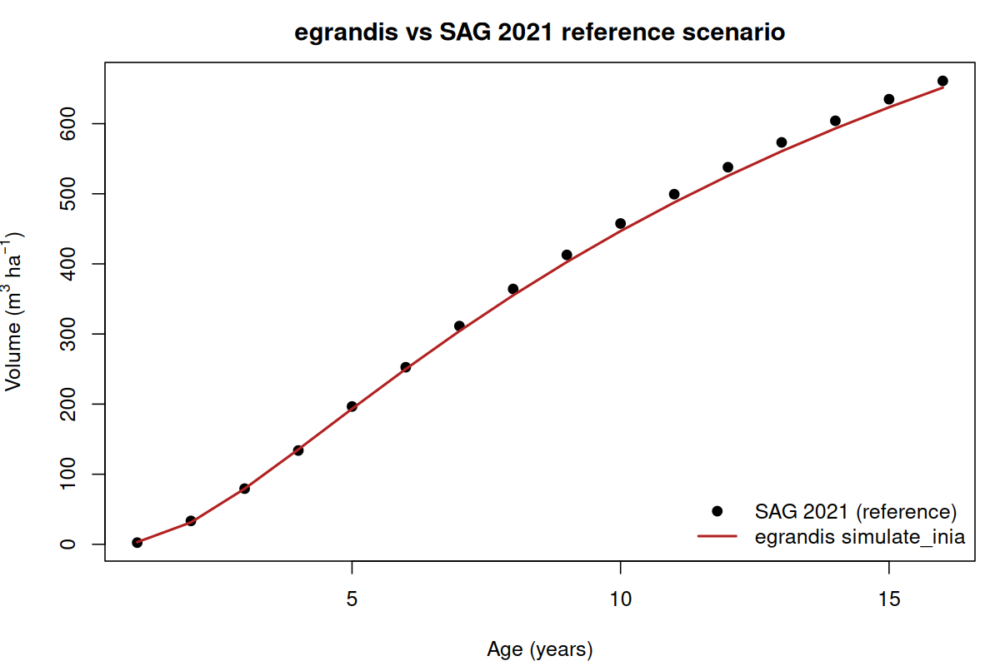
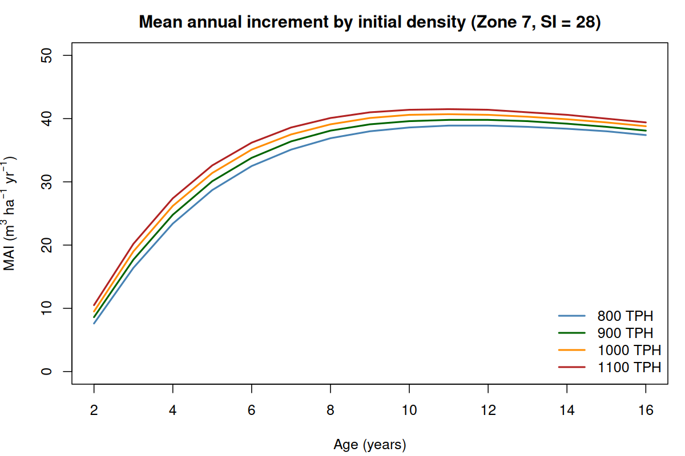
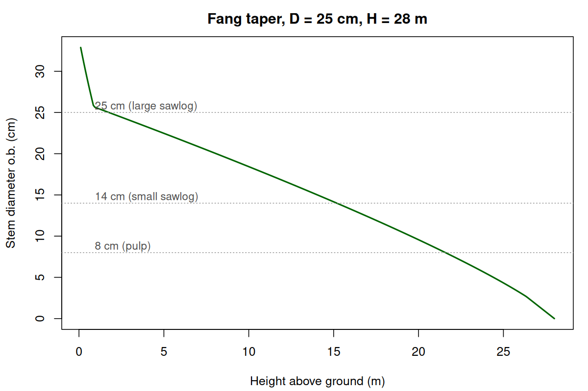
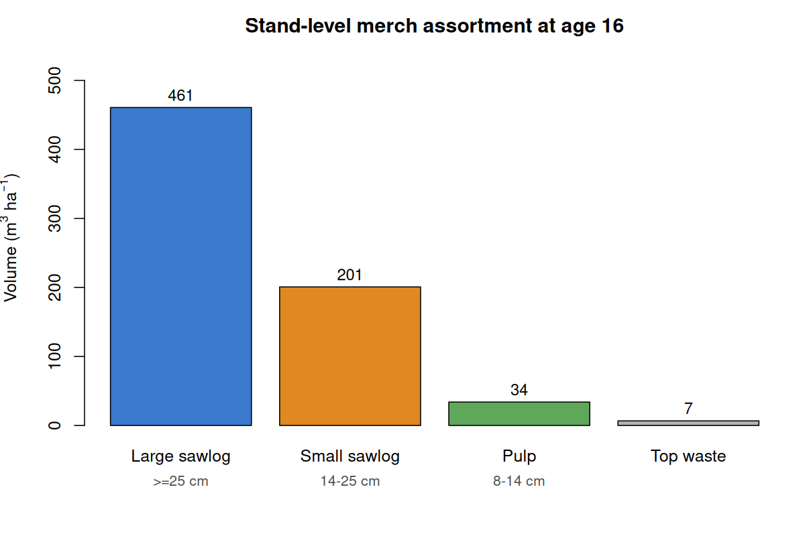
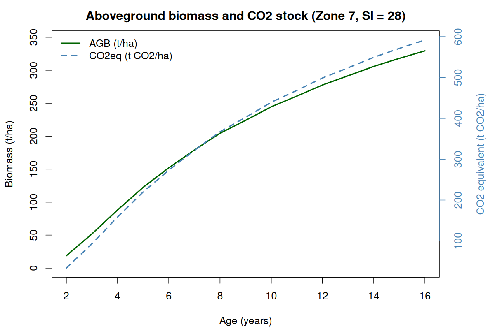

# egrandis

**Growth, yield, taper, and biomass models for *Eucalyptus grandis* clonal plantations**

An R package for simulating stand dynamics, log-product assortment, and aboveground biomass / carbon accounting in *E. grandis* plantations across subtropical South America (Paraguay, Uruguay, Argentina, southern Brazil). All three modules are interoperable: a stand simulation feeds the diameter distribution that drives both merchantable-volume bucking and biomass estimation.

## Installation

```r
# install.packages("remotes")
remotes::install_github("tsuga0722/egrandis")
```

## What's in the box

| Module | Public API | Calibration |
|---|---|---|
| **Stand simulator (INIA SAG grandis 2021)** | `simulate_inia()`, `inia_diam_dist()`, `inia_get_distribution()`, `inia_print_summary()` | Validated against the SAG online simulator at sag.inia.uy. 5 reference scenarios bundled as `sag_validation`. |
| **Taper + merchantable volume (Fang 2000)** | `inia_taper()`, `inia_tree_total_vol()`, `inia_tree_vol()`, `inia_height_at_d()`, `inia_height_class()`, `inia_merch_vol()` | Coefficients from Hirigoyen et al. 2021 (felled-tree measurements, Uruguay). |
| **Aboveground biomass + carbon** | `inia_tree_height()`, `inia_tree_agb()`, `inia_stand_agb()`, `inia_add_biomass()` | Jointly fit allometric + h-d curve against 3 SAG 2021 biomass scenarios (RRMSE 5.4%). IPCC default carbon fraction 0.49. |

## Quick start

```r
library(egrandis)

# Project a moderately stocked Zone 7 stand from age 2 to age 16
sim <- simulate_inia(
  SI = 28, N0 = 900, G0 = 7.0,
  Hd0 = 7.0, dmax0 = 13.0, SDd0 = 1.8,
  t0 = 2, t_end = 16, zone = 7
)
sim <- inia_add_biomass(sim)
mv  <- inia_merch_vol(sim, age = 16)

sim$trajectory[c(1, 4, 9, 15), c("age", "AMD", "AB", "Vol_Total", "Biomasa", "CO2eq")]
#>    age  AMD   AB Vol_Total Biomasa CO2eq
#> 1    2  7.0  7.0      17.0    18.7  33.6
#> 4    5 16.4 25.9     150.0   122.4 219.9
#> 9   10 28.0 38.9     395.7   244.6 439.5
#> 15  16 36.8 45.0     609.7   329.4 591.9

attr(mv, "totals")
#> vol_large_sawlog vol_small_sawlog         vol_pulp        top_waste
#>            460.8            200.7             33.9              6.6
#>            total
#>            702.1
```

## Validation against SAG 2021

The simulator tracks the SAG online reference to within 0.5 m²/ha basal area, 15 trees/ha mortality, 3% volume, and 1.5 cm maximum diameter across all 16 ages of the calibration scenarios.



Per-submodel tolerances documented and enforced in the test suite (143 testthat checks total):

| Submodel | Source | Achieved tolerance vs SAG |
|---|---|---|
| Dominant height (Hd) | RC2019 eqn 5 | Exact (< 0.2 m) |
| Basal area (G) | RC2019 eqn 6 | Exact (< 0.5 m²/ha) |
| Mortality (N) | Clutter-Jones, refit to SAG 2021 | ± 12 trees |
| Volume (V) | Stand-level exp, refit to SAG 2021 | < 3 % at age ≥ 5 |
| Max diameter (dmax) | Schumacher, refit Z7 | ± 1.2 cm |
| Diameter SD (SDd) | RC2019 eqn 8 | Exact (< 0.2 cm) |
| Diameter distribution | Inverse Weibull (Methol 2001) | ± 1-3 trees/class |

The bundled `sag_validation` dataset has five scenarios for spot-checking parameter changes:

```r
data(sag_validation)
names(sag_validation)
#> [1] "z7_si30_n550"          "z7_si25_n550"          "z7_si30_n1111"
#> [4] "z8_si30_n550"          "z7_si30_n550_thinned"
```

## Comparing densities

```r
densities <- c(800, 900, 1000, 1100)
sims <- lapply(densities, function(n) {
  simulate_inia(SI = 28, N0 = n,
                G0 = n * pi * (10 / 200)^2,
                Hd0 = 7.0, dmax0 = 13.0, SDd0 = 1.8,
                t0 = 2, t_end = 16, zone = 7)
})
```



The INIA basal-area equation has no explicit density term, so per-hectare BA converges across initial densities — peak MAI rises modestly with stocking but the timing is similar.

## Taper and merchantable volume

The Fang et al. (2000) compatible segmented system, fit by Hirigoyen et al. 2021 to felled-tree taper from Uruguay, supports diameter-at-any-height, height-to-small-end, and tree-level merchantable volume integration.

```r
inia_tree_total_vol(D = 25, H = 28)   # 0.59 m³
inia_tree_vol(D = 25, H = 28, d_top = 8)    # merch to 8 cm top  -> 0.58 m³
inia_height_at_d(d_top = 14, D = 25, H = 28) # 15.2 m
```



`inia_merch_vol()` runs the taper across the recovered diameter distribution and buckets stand volume into named products using a butt-up cascade (largest small-end takes the butt log, the next product takes the next section, and so on). Defaults are three generic solid-wood grades — `large_sawlog` (≥ 25 cm), `small_sawlog` (≥ 14 cm), and `pulp` (≥ 8 cm); pass a `products =` list to customise for any market-specific assortment.



> Two volume estimators, two purposes: `simulate_inia()` reports stand-level total volume from the INIA equation calibrated to SAG 2021 output; `inia_tree_total_vol()` and `inia_merch_vol()` use the Fang taper-volume system fit to felled-tree data. The two can differ by 10-20 % at the stand level because of different data sources and bark conventions. Use the one that matches your downstream calculation.

## Aboveground biomass and carbon

`inia_add_biomass()` appends `Biomasa`, `Carbon`, and `CO2eq` columns to the stand trajectory by walking each row, recovering the diameter distribution, applying a stand-specific exponential h-d curve, and summing per-class AGB:

```r
sim <- simulate_inia(SI = 28, N0 = 900, G0 = 7.0,
                     Hd0 = 7.0, dmax0 = 13.0, SDd0 = 1.8,
                     t0 = 2, t_end = 16, zone = 7)
sim <- inia_add_biomass(sim)

sim$trajectory[c(4, 9, 15), c("age", "Vol_Total", "Biomasa", "Carbon", "CO2eq")]
#>    age Vol_Total Biomasa Carbon CO2eq
#> 4    5     150.0   122.4   60.0 219.9
#> 9   10     395.7   244.6  119.9 439.5
#> 15  16     609.7   329.4  161.4 591.9
```



For one-off stand-level estimates without a full simulation, call `inia_stand_agb()` directly:

```r
inia_stand_agb(N = 700, Dq = 28, dmax = 35, SDd = 4.5, Hd = 24)
#> $agb     [1] 259.8
#> $carbon  [1] 127.3
#> $co2eq   [1] 466.7
```

Calibration was joint over allometric coefficients `a`, `b1`, `b2` (in `AGB = a · d^b1 · h^b2`) and the h-d curvature `k`, fit against three SAG 2021 scenarios (15 data points). Achieved performance:

| Scenario | Age 5 | Age 10 | Age 16 |
|---|---|---|---|
| Z7 SI = 30, 550 TPH | +3.0 % | +2.1 % | -3.5 % |
| Z7 SI = 25, 550 TPH | -14.8 % | +4.8 % | +1.6 % |
| Z7 SI = 30, 1111 TPH | +5.9 % | -1.3 % | -7.9 % |

Overall RRMSE 5.4 %; ages 7+ within ± 8 %. Carbon and CO₂-equivalent use IPCC subtropical-hardwood defaults (carbon fraction 0.49; CO₂eq = AGB × 1.797).

## Thinning regimes

```r
sim <- simulate_inia(
  SI = 28, N0 = 900, G0 = 7.0,
  Hd0 = 7.0, dmax0 = 13.0, SDd0 = 1.8,
  t0 = 2, t_end = 14, zone = 7,
  thins = list(
    list(age = 4, N_after = 600),
    list(age = 9, N_after = 300)
  )
)
sim$thinnings
sim$total_yield   # standing + thinned
```

## Zones

- **Zone 7** (Tacuarembó, Rivera — northern Uruguay): primary calibration. SI range 22-35 supported.
- **Zones 8 / 9** (central/western Uruguay): identical output in SAG 2021. Lower productivity. Mortality model is currently a no-op for these zones (known limitation; see *Known limitations* below).

## Known limitations

- **Basal area overshoots when initialized at age 1.** The Schumacher projection converges aggressively toward the asymptote (≈ 56 m²/ha for Zone 7) from low starting BA. Behaviour matches SAG 2021. For reliable projections, initialize from age 2 or later with measured G.
- **No competition-driven self-thinning.** All mortality is a background process; density feedback is not modelled.
- **Zone 8 / 9 mortality is currently zero.** The fitted Clutter-Jones `b = 0` for Z8/9 collapses to `N₂ = N₁`. To be re-fit; tests document this as a TODO rather than asserting it.
- **`inia_taper()` segment 3** (q > 0.94) is replaced with a linear cone tail to keep stem diameter monotone; the published `b3 = 2e-4` would otherwise make the formula diverge at the tip. The displaced volume is < 1 % of total tree volume.
- **The Fang taper-volume and INIA stand-level volume don't agree exactly.** They were fit to different data; see the box above.
- **Biomass calibration is scoped to Zone 7 at moderate-to-high density and SI 25-30.** Worst calibration case is around -15 % on the youngest / lowest-site / lowest-density point. Outside this envelope errors will grow.

## References

- Hirigoyen A, Navarro-Cerrillo RM, Bagnara M, Franco J, Resquin F, Rachid-Casnati C (2021). Modelling taper and stem volume considering stand density in *Eucalyptus grandis* and *Eucalyptus dunnii*. *iForest* 14: 127-136. doi:10.3832/ifor3604-014
- Hirigoyen A, Resquin F, Navarro-Cerrillo R, Franco J, Rachid-Casnati C (2021). Stand biomass estimation methods for *Eucalyptus grandis* and *Eucalyptus dunnii* in Uruguay. *BOSQUE* 42(1): 53-66.
- Rachid-Casnati C, Mason E, Woollons R (2019). Using soil-based and physiographic variables to improve stand growth equations in Uruguayan forest plantations. *iForest* 12: 237-245. doi:10.3832/ifor2926-012
- Resquin F, Navarro-Cerrillo RM, Carrasco-Letelier L, Rachid-Casnati C (2019). Influence of contrasting stocking densities on the dynamics of above-ground biomass and wood density of *E. benthamii*, *E. dunnii*, and *E. grandis* for bioenergy in Uruguay. *For Ecol Manag* 438: 63-74.
- Fang Z, Borders BE, Bailey RL (2000). Compatible volume-taper models for loblolly and slash pine based on a system with segmented-stem form factors. *Forest Science* 46: 1-12.
- Methol R (2003). SAG grandis: Sistema de Apoyo a la Gestión de Plantaciones de *Eucalyptus grandis*. INIA Serie Técnica 131.
- Methol R (2001). Comparisons of approaches to modelling tree taper, stand structure and stand dynamics in forest plantations. PhD thesis, University of Canterbury.
- IPCC (2006). Guidelines for National Greenhouse Gas Inventories, Vol 4, Ch 4 (Forest Land). Carbon fraction 0.49 for subtropical hardwoods.

## License

MIT

## Contributing

Contributions welcome. Open an issue first to discuss proposed changes. If you have PSP data from *E. grandis* plantations in the region and would like to collaborate on calibration or validation, please get in touch.
